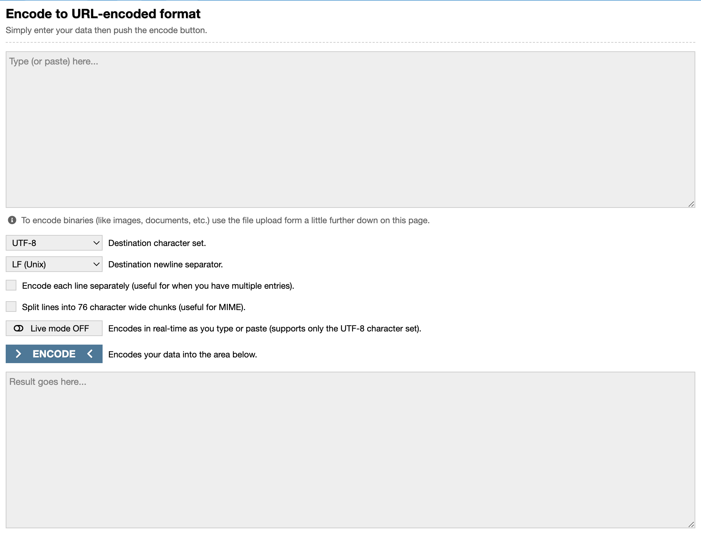
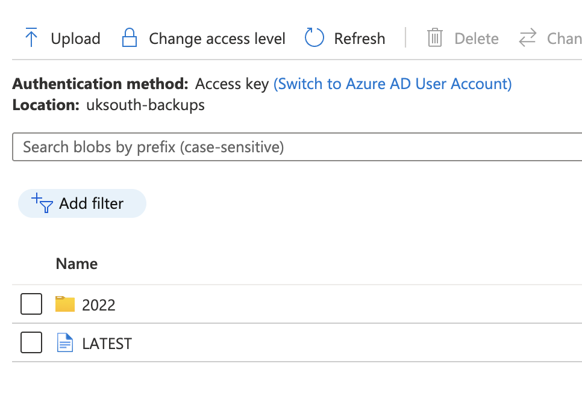

# CockroachDB Locality-aware Backups for Azure Blob

Any enterprise grade database software needs to have a mature story when it comes to Backup and Recovery. Historically, due to limitations in their architecture many relational databases technologies relied heavily on this in the event of a disaster. Using backups to recover the data to a backup system potentially in a different location, a secondary Disaster Recovery (DR) data centre for example. Technology has advanced over recent years driven mainly by the hyper scalers. Increasing the resilience of these solutions with the introduction of Read Replica standby nodes ready to take over if the master node fails. These can be spread over multiple locations. CockroachDB is leading a new wave of database technology called Globally Distributed SQL, these technologies distribute the data over many nodes, scaling reads and writes to deliver massive scale. Although these multi-node, high availability solutions are less dependent on backups for recovery they are still a requirement to protect against human error, malicious activity and data corruption. CockroachDB’s backup solution is to take advantage of an available Object Store. In a single region this is straightforward nodes send data directly to the object store in the same region. For restores, backups can be retrieved and restored. How does this work for a multi regional setup?

Before we get into this it is important to understand how backups are coordinated in CockroachDB. The following diagram shows the flow from BACKUP statement through to a complete backup in cloud storage:


CockroachDB performs the following tasks when completing a backup job:

1. Validates the parameters of the BACKUP statement then writes them to a job in the jobs system describing the backup.
1. Based on the parameters recorded in the job, and any previous backups found in the storage location, it determines which key spans and time ranges of data in the storage layer need to be backed up.
1. Instructs various nodes in the cluster to each read those keys and writes the row data to the backup storage location.
1. Records any additional metadata about what was backed up to the backup storage location.

## Locality-aware Backups

Locality-aware Backup can be created so that each node writes files only to the backup destination that matches the node locality configured at node startup. This is important for two major reasons, data transfer across regional boundaries can quickly become very expensive. This is a result of the public cloud providers charging increased rates for data transfers across regional boundaries. Secondly, helping you comply with data domiciling requirements. Legislation continually changes posing more and more restrictions on how data is stored. With Locality-aware backups you can ensure that the data you are backing up is stored in the correct location. This is important in large globally distributed systems.

A locality-aware backup is specified by a list of URIs, each of which has a `COCKROACH_LOCALITY` URL parameter whose single value is either default or a single locality key-value pair such as region=us-east. At least one `COCKROACH_LOCALITY` must be the default. Given a list of URIs that together contain the locations of all of the files for a single locality-aware backup, `RESTORE` can read in that backup.

Every node involved in the backup is responsible for backing up the ranges for which it was the leaseholder for at the time the distributed backup flow was planned. The locality of the node running the distributed backup flow determines where the backup files will be placed in a locality-aware backup. The node running the backup flow, and the leaseholder node of the range being backed up are usually the same, but can differ when lease transfers have occurred during the execution of the backup. The leaseholder node returns the files to the node running the backup flow (usually a local transfer), which then writes the file to the external storage location with a locality that matches its own localities (with an overall preference for more specific values in the locality hierarchy). If there is no match, the default locality is used.

## How to create Azure Storage for your configure Locality Aware Backups

If you want to follow along you will need to install a few things to get started.

List of required prerequisites:

- Azure CLI
- Cockroach CLI
- A multi-regional CockroachDB cluster.

## Step 1: Prepare your variables

To make it easy to follow along we are  going to set a number of variables. The loc1-3 variables need to reflect the three Azure regions where your CockroachDB multi region cluster is deployed. In this example the cluster is deployed across `uksouth`, `ukwest` and `northeurope`. The remaining variables are to record the names of the storage account and containers.

```
loc1="uksouth"
loc2="ukwest"
loc3="northeurope"
rg="mb-crdb-aks-multi-region"
loc1_storage_account="crdbuksouthstorageacc"
loc2_storage_account="crdbukweststorageacc"
loc3_storage_account="crdbnortheurstorageacc"
loc1_storagecontainer="uksouth-backups"
loc2_storagecontainer="ukwest-backups"
loc3_storagecontainer="northeurope-backups"
```

## Step 2: Create Storage Accounts and Containers in Azure

Once you have the resource group created you can create the required Storage Accounts and Containers to sort our backups. As we are creating locality-aware backups we need to create one in each region.
Create a Storage Account in the first region. Storage account names must be between 3 and 24 characters in length and may contain numbers and lowercase letters only. Your storage account name must be unique within Azure. No two storage accounts can have the same name.

```
az storage account create \
  --name $loc1_storage_account \
  --resource-group $rg \
  --location $loc1 \
  --sku Standard_RAGRS \
  --kind StorageV2
```

Once the Storage Account is created then create the Container to store the backups.

```
az storage container create \
 -n $loc1_storagecontainer \
 --fail-on-exist \
 --account-name $loc1_storage_account
```

Now do the same for the second region.

```
az storage account create \
  --name $loc2_storage_account \
  --resource-group $rg \
  --location $loc2 \
  --sku Standard_RAGRS \
  --kind StorageV2
 
az storage container create \
 -n $loc2_storagecontainer \
 --fail-on-exist \
 --account-name $loc2_storage_account
```

And the third region.

```
az storage account create \
  --name $loc3_storage_account \
  --resource-group $rg \
  --location $loc3 \
  --sku Standard_RAGRS \
  --kind StorageV2
 
az storage container create \
 -n $loc3_storagecontainer \
 --fail-on-exist \
 --account-name $loc3_storage_account
```

## Step 3: URL Encode Storage Account Access Keys

For CockroachDB to be able to access the storage to write the backups we need to obtain the access keys for each account and URL Encode them to remove any unsupported characters.

```
az storage account keys list -g $rg -n $loc1_storage_account --query "[0].value" -o tsv
az storage account keys list -g $rg -n $loc2_storage_account --query "[0].value" -o tsv
az storage account keys list -g $rg -n $loc3_storage_account --query "[0].value" -o tsv
```

Three keys will be outputted to the screen, see below for an example output.

Example Output:
```
*****w0VrJKhgKyN52E7vGNCyJEt0GYQMC/efxSS6/qhdCfkIDACHJc1GSbP0YURp2Uf7iV2Rqm0+ASta7vwrw==
*****5quzl8sjBUpI5+Mev8LlC5AbKnfSC5xjGP1wnt5iO/Hwkk8QBvKAIa/CXbrxqtFZUkLo8dg+ASttxDOkQ==
*****6YRjoX/bz4GrAw1EVVApQYV4Zz+HRZ5rA+VaGDJEo6Yj1IkzptHNxDYtXn8l5QYvY2Haw3L+AStdB6mFA==
```

These access keys contain unsupported characters for URLs so need to be URL Encoded. There are a number of ways to do this but I have just used this site to do it [URL Encoder](www.urlencoder.org).



Once you have encoded all three Access Keys we can use these in the next step which is to create our backups!

## Step 4: Creating Locality-aware Backups

Connect to your cluster using the CockroachDB SQL Client. My cluster is running in AKS so I will deploy a pod running the SQL client and then connect to this pod. Deploy the pod from the manifest in the CockroachDB github repo.

```
kubectl create -f https://raw.githubusercontent.com/cockroachdb/cockroach/master/cloud/kubernetes/multiregion/client-secure.yaml --namespace $loc1
```

Connect to that pod once deployed.

```
kubectl exec -it cockroachdb-client-secure -n $loc1 -- ./cockroach sql --certs-dir=/cockroach-certs --host=cockroachdb-public
```

If you are not running kubernetes then just connect with the CockroachDB SQL Client the way you would normally.

To determine the locality that a node was started with, run SHOW LOCALITY. Run this on a node in each region. In the cluster that I’m working on, the localities match the region names.

```
Example Output:
           locality
------------------------------
  cloud=azure,region=uksouth
(1 row)
```

The next step is the one I found the most tricky. The backup command is made up of a number of elements and these have to be in the right order. The first component is the Azure Container name followed by the `COCKROACH_LOCALITY`, these two elements are separated by a question mark. Next, separated by an ampersand is the Azure Account Name which is the name of your Storage Account. This is followed by the URL encoded Access Key. Example below.
```
('azure://uksouth-backups?COCKROACH_LOCALITY=default&AZURE_ACCOUNT_NAME=crdbuksouthstorageacc&AZURE_ACCOUNT_KEY=*****w0VrJKhgKyN52E7vGNCyJEt0GYQMC%2FefxSS6%2FqhdCfkIDACHJc1GSbP0YURp2Uf7iV2Rqm0%2BASta7vwrw%3D%3D');
```

For the full backup command you must include all three regions in the same format as below.

```
BACKUP INTO
      ('azure://uksouth-backups?COCKROACH_LOCALITY=default&AZURE_ACCOUNT_NAME=crdbuksouthstorageacc&AZURE_ACCOUNT_KEY=MwbWRw0VrJKhgKyN52E7vGNCyJEt0GYQMC%2FefxSS6%2FqhdCfkIDACHJc1GSbP0YURp2Uf7iV2Rqm0%2BASta7vwrw%3D%3D', 'azure://uksouth-backups?COCKROACH_LOCALITY=region%3Duksouth&AZURE_ACCOUNT_NAME=crdbuksouthstorageacc&AZURE_ACCOUNT_KEY=*****w0VrJKhgKyN52E7vGNCyJEt0GYQMC%2FefxSS6%2FqhdCfkIDACHJc1GSbP0YURp2Uf7iV2Rqm0%2BASta7vwrw%3D%3D', 'azure://ukwest-backups?COCKROACH_LOCALITY=region%3Dukwest&AZURE_ACCOUNT_NAME=crdbukweststorageacc&AZURE_ACCOUNT_KEY=*****5quzl8sjBUpI5%2BMev8LlC5AbKnfSC5xjGP1wnt5iO%2FHwkk8QBvKAIa%2FCXbrxqtFZUkLo8dg%2BASttxDOkQ%3D%3D', 'azure://northeurope-backups?COCKROACH_LOCALITY=region%3Dnortheurope&AZURE_ACCOUNT_NAME=crdbnortheurstorageacc&AZURE_ACCOUNT_KEY=*****6YRjoX%2Fbz4GrAw1EVVApQYV4Zz%2BHRZ5rA%2BVaGDJEo6Yj1IkzptHNxDYtXn8l5QYvY2Haw3L%2BAStdB6mFA%3D%3D');
```

Below is the output you can expect for a successful backup.

```
       job_id       |  status   | fraction_completed |   rows   | index_entries |   bytes
---------------------+-----------+--------------------+----------+---------------+-------------
  820385660877209601 | succeeded |                  1 | 35668798 |       2938335 | 2743637552
(1 row)


Time: 42.149s total (execution 42.148s / network 0.001s)
```


## Step 5: Validate the backup

To validate your backup go to the Azure Portal, find each of your storage accounts and check the contents of each of your Containers. In each Container you should see some contents now.



Final Thoughts…
So if you are deploying CockroachDB in a multi-region configuration in Azure consider configuring locality-aware backups. By using this approach you can reduce your data transfer cost by sending data to object storage in the same region. Also if you have to ensure that data does not leave a specific location for legislative reasons then locality-aware backups will ensure this. Give them a go!!!

